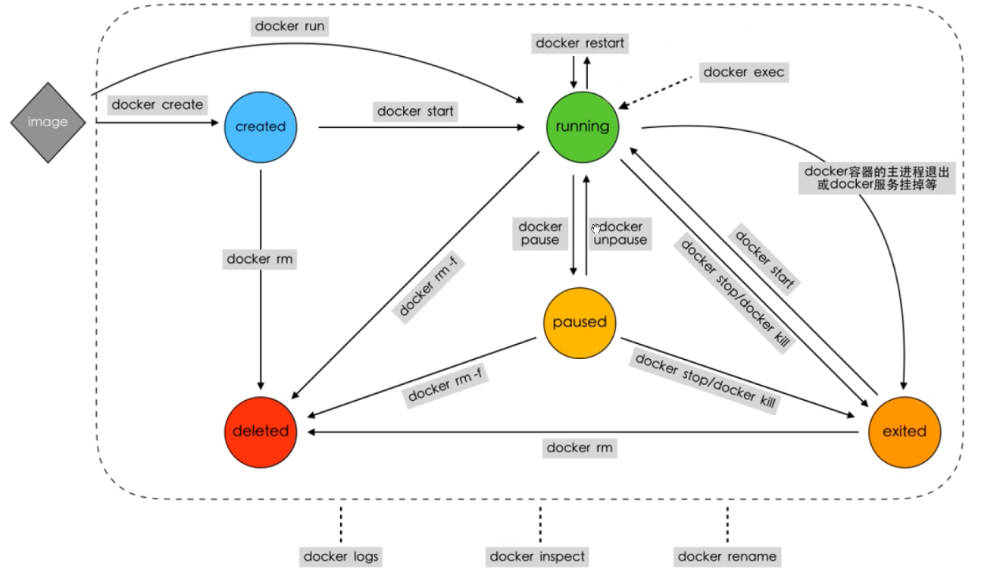

## docker

开发、容纳、运行应用程序的平台

在容器安全的隔离运行应用程序

简易版的Linux环境





**docker引擎**

cs结构的程序
1. server
    长时间运行守护进程
2. Rest API
3. CLI
    command line


**docker对象**

- images,
- containers,
- data volumes
- ...


**docker daemon**

1. docker守护进程

2. 运行在host之上，不需要直接交互，通过cli访问

**docker client**

接受用户指令并和docker守护进程通信

**docker images**
只读模板

**docker registries**
包含镜像的库

**docker containers**
通过镜像创建
每个容器都是独立的、安全的运行平台
容器中运行的是docker的组件


## 安装docker引擎（CentOS7）

https://docs.docker.com/install/linux/docker-ce/centos/

```shell
1. 准备
    需要CentOS 7以上
    查看centos版本
    cat  /etc/redhat-release
    检查内核版本
        uname -r   需要大于等于3.10

2. 卸载旧版本
    $ sudo yum remove docker \
                  docker-client \
                  docker-client-latest \
                  docker-common \
                  docker-latest \
                  docker-latest-logrotate \
                  docker-logrotate \
                  docker-engine

3. 设置repository
    $ sudo yum install -y yum-utils \
      device-mapper-persistent-data \
      lvm2
      
    $ sudo yum-config-manager \
        --add-repo \
        https://download.docker.com/linux/centos/docker-ce.repo
    上面这个命令由于是国外网站，可能会访问超时等
    $ sudo yum-config-manager \
        --add-repo \
        http://mirrors.aliyun.com/docker-ce/linux/centos/docker-ce.repo

4. INSTALL DOCKER CE
    $ sudo yum install docker-ce docker-ce-cli containerd.io

    如果要安装指定版本的话
    $ yum list docker-ce --showduplicates | sort -r

    docker-ce.x86_64  3:18.09.1-3.el7                     docker-ce-stable
    docker-ce.x86_64  3:18.09.0-3.el7                     docker-ce-stable
    docker-ce.x86_64  18.06.1.ce-3.el7                    docker-ce-stable
    docker-ce.x86_64  18.06.0.ce-3.el7                    docker-ce-stable

    比如, 18.09.1替换掉下面的<VERSION_STRING>
    $ sudo yum install docker-ce-<VERSION_STRING> docker-ce-cli-<VERSION_STRING> containerd.io
    sudo yum install docker-ce-18.09.1 docker-ce-cli-18.09.1 containerd.io

5. Start docker
    $ sudo systemctl start docker
    $ sudo systemctl enable docker  开机启动

6. Verify that Docker CE is installed correctly by running the hello-world image.
    $ sudo docker run hello-world

7. Uninstall Docker CE
    $ sudo yum remove docker-ce
    主机上的图像，容器，卷或自定义配置文件不会自动删除。要删除所有图像，容器和卷：
    $ sudo rm -rf /var/lib/docker
8. 被墙了，还是用DaoCloud加速器吧
方法修改 /etc/docker/daemon.json 里的"registry-mirrors"

    https://www.daocloud.io/mirror
    或者用这个http://www.runoob.com/docker/centos-docker-install.html
    https://blog.csdn.net/u012943767/article/details/79615854
    
再或者用阿里云的docker镜像加速器https://cr.console.aliyun.com/cn-hangzhou/instances/mirrors
sudo mkdir -p /etc/docker
sudo tee /etc/docker/daemon.json <<-'EOF'
{
  "registry-mirrors": ["https://k3ibf4ye.mirror.aliyuncs.com"]
}
EOF
sudo systemctl daemon-reload
sudo systemctl restart docker

9. 开机启动docker
$ sudo systemctl enable docker
```


## docker基本操作

### 一些常用参数介绍

-a    all

-q    id，取到那一串hash值

-i     交互式

-t     伪终端     

-d    后台运行，守护进程

--rm   退出时删除容器


### 查看本地镜像

sudo docker images 或者 docker image ls

tag / push / pull 镜像

```shell
1. 查看镜像
    $> sudo docker images
2. Tag the image
    $> docker tag image username/repository:tag
3. 查看镜像
    $> sudo docker images
4. 登录docker hub
    $> docker login
5. Publish the image
    $> docker push username/repository:tag
6. Pull and run the image from the remote repository
    $> docker run -p 4000:80 username/repository:tag
7. 删除镜像
    $> docker rmi image_id
```


### 镜像管理

```shell
1. 列出镜像
    $> docker images
2. 通过标记运行容器
    ## 如果未指定ubuntu的tag，默认使用latest版本
    $> docker run -t -i ubuntu:14.04 /bin/bash
3. pull一个镜像
    $> docker pull image_name
    上述命令中，镜像的名字应该添加仓库地址，以区分本地仓库和Docker Hub,只不过使用Docker Hub可以省略仓库地址,上述命令的完全形式如下：
    $> docker pull registry.docker-cn.com/library/nginx:latest
4. run一个容器
    # 如果镜像本地有就用本地的，没有就从网上拉取
    $> docker run image_name /usr/bin/echo hello world
5. 搜索镜像
    $> docker search redis
6. pull自己的镜像
    $> docker pull training/sinatra
7. 更新并提交镜像
    ## 更新镜像需要先创建容器
    $> docker run -i -t image_name /bin/bash
    ## 做一些修改
    $> echo "hello world" > tmp.txt
    $> exit
    ## 在本地产生新的镜像
    $> docker commit -m "create a text" -a "middle" container_id [dockerhub_username/]image_name:tag
8. 查看镜像历史信息
    $> docker history centos
9. 导出镜像
    $> docker save -o nginx.tar ngnix
10. 导入镜像
    $> docker load --input/-i nginx.tar
11. 在image上tag操作（重命名）
    $> sudo docker tag image_id middle/myubuntu:v2
    ## 其实是两个image共享一个image_id。需要时，把旧的删除掉docker rmi middle/myubuntu:v1

```


### 通过案例学习docker

```shell
1. 运行容器
    $> sudo docker run centos /usr/bin/echo "helloworld"
    容器运行时间和命令时间相同
2. 运行交互式容器
    $> sudo docker run -it ubuntu /bin/bash
    ## -t 伪字符终端    -i 交互式(interactive)
3. 在容器中写命令
    $> ls /
    $> pwd
4. 退出交互式shell
    $> exit
    $> ctrl + D
```


### container容器基本操作


#### 查看容器

1. 所有的容器

   ```shell
   $> sudo docker ps -a
   ```

2. 最近运行的容器(只返回一个,此容器也可能是stop的)

   ```shell
   $> sudo docker ps -l
   ```
   
3. 查看状态为exited的容器

   ```bash
   $> sudo docker container ls -f "status=exited"
   ```

   

**docker命令解释**

告知OS使用docker    子命令    加载的镜像
docker              run      hello-world


#### 创建容器并以守护进程方式运行

```shell
1. 使用-d参数运行容器
    $> docker run -d centos /bin/bash -c "while true; do echo hello world; sleep 1; done"
    84a6baf9c2bcd2380a937e2bb5a333c886384bab8bc93c5b57ee35b9d220bd1f
2. 以上命令输出长串，是容器的id，可以通过该id操纵容器
3. 查看容器日志
    $> docker logs container_id或者container_name
```

#### 创建容器

```shell
 $> docker create nginx
```

#### 退出容器

```bash
 $> exit            // 容器停止退出
 $> Ctrl+P+Q        // 容器不停止退出
```

#### 停止容器

```shell
 $> docker stop container_id或者container_name
```

#### 进入正在运行的容器

```shell
 $> docker exec -it container_name /bin/bash
 $> docker attach container_name
```

#### 启动容器

```shell
 $> docker start container_id或者container_name
```

#### 删除容器

```shell
 $> docker rm container_id或者container_name 可接多个容器
 
# 列出容器的ID     -q取容器ID
[root@centos ~]# docker ps -aq
5f98c9357e3b
7de38cf11812
148ef47d3d6d

# 删除所有容器
[root@localhost ~]# docker rm $(docker container ls -aq)


# 删除已经停止运行的容器
[root@localhost ~]# docker rm $(docker ps -f "status=exited" -q)
或者docker container prune
```

#### 容器命名

```shell
1. 创建容器的时候
   $> docker run -d -P --name runoob training/webapp python app.py
2. 容器stop之后
   $> docker rename <my_container> <my_new_container>
```

#### **拷出容器内的文件**

```bash
$> docker cp 容器id:/tmp/yum.log /root          // 将yum.log拷贝到主机root
```


#### 容器迁移

```shell
## 导出容器是导出一个已经创建的容器到文件，不管这个容器是否处于运行状态
## 导出容器
$> docker export -o nginx.tar 7877
## 导入容器
$> docker import nginx.tar nginx   （会生成ngnix:latest镜像。之后可以自己运行起容器）
```


#### 运行简单的应用程序

```shell
1. 查看docker版本
    $> docker version
2. 查看帮助
    $> docker --help
3. 查看子命令帮助
    $> docker run --help
4. 运行容器
    ## -d 后台方式    -P:映射所有暴露的端口   -p hostPort:containerPort 映射指定的端口
    ## 可以指定容器绑定的网络地址，比如绑定 127.0.0.1。
    $> docker run -d -P training/webapp python app.py
    $> docker run -d -p 80:5000 training/webapp python app.py
    $> docker run -d -p 127.0.0.1:5001:5000 training/webapp python app.py
5. 通过浏览器，使用host主机映射的端口访问容器的客户机web服务器
    http://localhost:80
6. 查看容器的ip地址
    docker-machine ip container_id  # 我的这个好像有问题哦
```

#### 端口映射

```shell
1. 查看port子命令
    $> docker port --help
2. 查看容器中的指定端口在宿主机上的映射端口是多少
    $> docker port container_id
    5000/tcp -> 0.0.0.0:80
    $> docker port container_id 5000
    0.0.0.0:80
```

#### 查看web程序的log

```shell
## -f:不退出日志
$> docker logs -f container_id
```

#### 查看容器的进程

```shell
$> docker top container_id
```

#### 查看所有容器的运行占用资源情况

```shell
$> docker stats -a
```

#### 检查容器的底层信息

```shell
$> docker inspect container_id
```


## 数据卷管理

#### 不指定挂载目录

```shell
$> docker run -it --name centOs -v /data centos /bin/bash

上述命令会创建一个CentOs的容器并且把容器内部的/data目录作为数据卷挂载，并且进入了容器。

上述命令没有指定挂载目录，但是docker会有默认的挂载目录
查看挂载在宿主机上的目录
[root@localhost ~]# docker inspect centOs|grep /var/lib/docker/volumes
在Mounts下有一个
"Source":"/var/lib/docker/volumes/89d6562b9c1fe10dd21707cb697a5d481b3c1b000a69b762f540fa826a16972a/_data",
或者执行下面的命令(查看某个字段，-f)
[root@localhost ~]# docker inspect -f {{.Mounts}} centOs

```

#### 指定挂载目录

```shell
$> docker run -it --name centOs -v /home/middle/data:/data centos
$> docker run -it --name centOs -v /home/middle/data:/data:ro centos
//ro表示read only。。主机可读可写，容器只能读
```


#### 创建数据卷容器

一个容器访问另一个容器的Volume。关键词--volumes-from

```shell
启动一个名为xqsj_Container容器，此容器包含两个数据卷/var/volume1和/var/volume2（这两个数据卷目录是在容器里的，容器创建的时候会自动生成这两目录）

数据卷容器只需要创建，不需要运行！不管容器是否正在运行，Volume都不会被删除。
（以下命令未指定挂载在主机的目录，可以自己设置）
[root@localhost ~]# docker create -v /var/volume1 -v /var/volume2 --name xqsj_Container centos

查看宿主机上与数据卷对应的目录路径：
[root@localhost ~]# docker inspect xqsj_Container|grep /var/lib/docker/volumes
                "Source": "/var/lib/docker/volumes/b8d2e5bcadf2550abd36ff5aa544c721a45464a4406fb50979815de773086627/_data",
                "Source": "/var/lib/docker/volumes/a34fa3a0a7a2f126b0d30a32b1034f20917ca7bd0dda346014d768b5ebb68f6b/_data",

由上面命令结果可以查到，两个数据卷/var/volume1和/var/volume2下的数据在/var/lib/docker/volumes/下对于的两个目录的_data下面
创建App_Container容器，挂载xqsj_Container容器中的数据卷
[root@linux-node2 ~]# docker run -t -i --rm --volumes-from xqsj_Container --name App_Container centos /bin/bash
[root@b9891bcdfed0 /]# ls /var/volume1         //发现这两个数据卷都存在
[root@b9891bcdfed0 /]# ls /var/volume2
[root@b9891bcdfed0 /]# echo "this is volume1" > /var/volume1/test1
[root@b9891bcdfed0 /]# echo "this is volume2" > /var/volume1/test2

可以再创建一个容器，挂载App_Container中从xqsj_Container挂载的数据卷。当然也可以直接挂载初始的xqsj_Container容器数据卷
[root@linux-node2 ~]# docker run -t -i --rm --volumes-from App_Container --name LastApp_Container centos /bin/bash
[root@b4c27e360614 /]# ls /var/volume1
test1
[root@b4c27e360614 /]# ls /var/volume2
test2
[root@b4c27e360614 /]# cat /var/volume1/test1 
this is volume1
[root@b4c27e360614 /]# cat /var/volume2/test2 
this is volume2

即便是删除了初始的数据卷容器xqsj_Container，或是删除了其它容器，但只要是有容器在使用该数据卷，那么它里面的数据就不会丢失！（除非是没有容器在使用它们）
```


#### 备份

```shell
docker run --volumes-from centOs -v $(pwd):/backup --name worker centos tar cvf /backup/backup.tar /data 
```


#### 恢复

```shell
docker run --volumes-from centOs -v $(pwd):/backup centos tar xvf /backup/backup.tar -C /data
```


#### 删除数据卷

如果使用docker rm命令来移除容器，有可能会产生很多无用的数据卷，它们会占用空间。

Volume可以使用两种方式删除数据卷：

- 使用 docker rm -v 命令，这个命令移除容器的同时也会移除数据卷
- 使用 docker run --rm 这个命令会在容器退出时清除数据

**注意！以上两种方式只能删除没有容器挂载的Volume。如果有容器正在挂载的数据卷永远不会被删除。**


下面还有一些关于数据卷比较有用的命令：

```shell
$> docker volume ls 列出所有数据卷
$> docker volume prune 删除无用的数据卷
```


#### docker volume

新版本出现的docker volume命令：创建数据卷
Docker 新版本中引入了 docker volume 命令来管理 Docker volume。

```shell
使用默认的 'local' driver 创建一个volume数据卷
[root@localhost ~]# docker volume create --name kevin
kevin

[root@localhost ~]# docker volume ls
DRIVER              VOLUME NAME
local               kevin

[root@localhost ~]# ll /var/lib/docker/volumes
total 24
drwxr-xr-x 3 root root    19 Oct 28 00:32 kevin
-rw------- 1 root root 32768 Oct 28 00:32 metadata.db

使用这个名为kevin的数据卷
[root@localhost ~]# docker run -d -P --name test1 -v kevin:/volume docker.io/centos
375ef74722404f5c52fde9f2ea7ea322c57e07fbac0b0e69825f077328fdb363

[root@localhost ~]# docker inspect test1
.........
 "Mounts": [
            {
                "Type": "volume",
                "Name": "kevin",
                "Source": "/var/lib/docker/volumes/kevin/_data",
                "Destination": "/volume",
                "Driver": "local",
                "Mode": "z",
                "RW": true,
                "Propagation": ""
            }

即将kevin数据卷对应在本机上的目录/var/lib/docker/volumes/kevin/_data挂载给容器内的 /volume 目录。
```


#### 例子:使用nginx镜像

在容器中相关位置分别是：

​	日志位置：/var/log/nginx/
​	配置文件位置：/etc/nginx/
​	项目位置：/usr/share/nginx/html

```shell 
配置文件相对来说有点麻烦，一般nginx只需要加载nginx.conf就可以了，
在dokcer中，是首先加载nginx.conf，
然后在nginx.conf有这么一行include /etc/nginx/conf.d/*.conf;，
就是加载conf.d目录下的配置文件。所以对于配置只需要挂载到conf.d,覆盖掉即可。

$> docker run -p 80:80 --name mynginx \ 
    -v $PWD/nginx/html:/usr/share/nginx/html \ 
    -v $PWD/nginx/nginx.conf:/etc/nginx/nginx.conf \ 
    -v $PWD/nginx/conf.d:/etc/nginx/conf.d \ 
    -v $PWD/nginx/log:/var/log/nginx \ 
    -d nginx

运行上面的命令需要将配置文件弄好，配置文件在下面
这里有几个注意事项：
（1）第一个“-v”，是项目位置，把项目放到挂载到的目录下即可；

（2）第二个“-v”，是挂载的主配置文件"nginx.conf"，注意"nginx.conf"文件内有一行"include /etc/nginx/conf.d/*.conf;"，这个include指向了子配置文件的路径，此处注意include后所跟的路径一定不要出错。

（3）第三个“-v”，把docker内子配置文件的路径也挂载了出来，注意要与（2）中include指向路径一致

（4）重点强调一下，nginx.conf是挂载了一个文件（docker是不推荐这样用的），conf.d挂载的是一个目录
配置时一定要铆定一个思路：挂载出来的文件运行时是要加载到docker进程中去的！
```


将容器中/etc/nginx/nginx.conf内容复制到$PWD/nginx/nginx.conf中（也可直接复制下面的）
```conf
user  nginx;
worker_processes  1;

error_log  /var/log/nginx/error.log warn;
pid        /var/run/nginx.pid;


events {
    worker_connections  1024;
}


http {
    include       /etc/nginx/mime.types;
    default_type  application/octet-stream;

    log_format  main  '$remote_addr - $remote_user [$time_local] "$request" '
                      '$status $body_bytes_sent "$http_referer" '
                      '"$http_user_agent" "$http_x_forwarded_for"';

    access_log  /var/log/nginx/access.log  main;

    sendfile        on;
    #tcp_nopush     on;

    keepalive_timeout  65;

    #gzip  on;

    include /etc/nginx/conf.d/*.conf;
}
```

将容器中/etc/nginx/conf.d/default.cof内容复制到$PWD/nginx/conf.d/default.cof中（也可直接复制下面的）
```conf
server {
    listen       80;
    server_name  localhost;

    #charset koi8-r;
    #access_log  /var/log/nginx/host.access.log  main;

    location / {
        root   /usr/share/nginx/html;
        index  index.html index.htm;
    }

    #error_page  404              /404.html;

    # redirect server error pages to the static page /50x.html
    #
    error_page   500 502 503 504  /50x.html;
    location = /50x.html {
        root   /usr/share/nginx/html;
    }

    # proxy the PHP scripts to Apache listening on 127.0.0.1:80
    #
    #location ~ \.php$ {
    #    proxy_pass   http://127.0.0.1;
    #}

    # pass the PHP scripts to FastCGI server listening on 127.0.0.1:9000
    #
    #location ~ \.php$ {
    #    root           html;
    #    fastcgi_pass   127.0.0.1:9000;
    #    fastcgi_index  index.php;
    #    fastcgi_param  SCRIPT_FILENAME  /scripts$fastcgi_script_name;
    #    include        fastcgi_params;
    #}

    # deny access to .htaccess files, if Apache's document root
    # concurs with nginx's one
    #
    #location ~ /\.ht {
    #    deny  all;
    #}
}
```

查看容器挂载情况

```shell 
$> docker inspect 容器名 | grep Mounts -A 20    ## -A 20 显示Mounts后面20行
```


## 使用Dockerfile构建镜像

### Dockerfile基本结构

- 基础镜像

- 维护者信息

- 镜像操作指令

- 容器启动命令

[Dockerfile]

```dockerfile
# 基础镜像
FROM centos

# 维护者信息
MAINTAINER middlexu <15510485772@163.com>

# 镜像操作指令
RUN echo "hello word !"

# 指定启动命令
CMD /bin/bash
```


### Dockerfile指令

| 指令        | 说明                                                         |
| ----------- | ------------------------------------------------------------ |
| FROM        | 指定创建镜像的基础镜像                                       |
| MAINTAINER  | 指定维护者的信息                                             |
| RUN         | 运行命令                                                     |
| CMD         | 指定启动容器是默认的执行命令                                 |
| LABEL       | 指定生成镜像的元数据标签信息                                 |
| EXPOSE      | 声明镜像内服务所监听的端口                                   |
| EVN         | 指定环境变量                                                 |
| ADD         | 复制文件本机的文件/文件夹到容器对应的目录下，如果为tar文件，会自动解压 |
| COPY        | 复制文件本机的文件/文件夹到容器对应的目录下,一般情况下复制文件使用COPY，仅仅在需要解压的情况下才会使用COPY |
| EMTRYPOINT  | 指定镜像的默认入口                                           |
| VOLUME      | 创建数据卷挂载点                                             |
| USER        | 指定运行容器时的用户名或UID                                  |
| WORKDIR     | 指定工作目录                                                 |
| ARG         | 指定镜像内的参数                                             |
| ONBUILD     | 配置当创建的镜像作为其他镜像的基础镜像时，执行的创建操作指令 |
| STOPSIGNAL  | 容器的退出信号                                               |
| HEALTHCHECK | 如何进行健康检查                                             |
| SHELL       | 指定默认使用的shell类型                                      |


#### RUN 指定

RUN指令是用来执行命令行命令的，在构建镜像的过程中运行，RUN命令有两种格式：

- shell格式：RUN <命令>
- exec格式 ：RUN ["可执行文件","参数一","参数二"]

RUN使用shell格式就像执行shell脚本一样，默认在终端中运行`/bin/sh -c <命令>`,使用exec则不会这样，可以指定用其他shell程序来执行，如：`RUN ["/bin/bash","-c","echo hello"]`这样。


需要注意的是每一条`RUN`命令都会在当前镜像基础上添加一层，所以执行命令的时候尽量将一个任务的`shell`脚本写在一条指令上。

下面这样的写法是不正确的：

```dockerfile
RUN apt-get update
RUN apt-get instll -y gcc libc6-dev
```

而应该写成：

```dockerfile
RUN apt-get update && apt-get instll -y gcc libc6-dev
```

如果命令太长可以使用\进行换行.


#### CMD 指令

CMD指令用来指定启动容器是默认执行的命令。是构建镜像完成之后，运行容器时执行。它支持3种格式：

- CMD ["executable","param1","param2"] 使用exec执行
- CMD command param1 param2 在 /bin/sh 中执行
- CMD ["param1","param2"] 提供给ENTRYPOINT的默认参数

每个Dockerfile只能有一条CMD命令，如果指定了多条CMD，只有最后一条会执行。

如果用户在启动容器的时候指定了运行的命令(作为docker run的参数)，则会覆盖掉CMD指定的命令。


#### LABEL 指令

这个指令用来给镜像添加信息，使用docker inspect的时候可以查看到

用法：

```dockerfile
LABEL version="1.0"
```


#### EXPOSE 指令

这个指令用于镜像内服务所监听的端口

用法：

```dockerfile
EXPOSR 80 443 22
```

该指令只起到声明作用，在启动容器的时候需要添加-P或者-p参数来进行端口映射。


#### ENV 指令

这个指令用于指定环境变量。

格式：

```dockerfile
ENV <key> <value>
ENV <key>=<value> <key>=<value> ...
```

这里指定的环境在容器运行时可以被覆盖掉，使用docker run --env参数.

这里指定的环境在容器运行时可以被覆盖掉，使用docker run --env参数.


#### ADD指令

该命令将复制指定目录 路径下的内容到容器中的路径下

格式：

```dockerfile
ADD <src> <dest>
```

其中src可以是Dockerfile所在的目录的一个相对路径，也可以是url,还可以是一个tar文件，**会自动解压**。\<dest\> 为镜像中的绝对路径，或者相对于工作目录(WORKDIR)的相对路径。路径支持正则表达式如:

```dockerfile
ADD *.c /code/
```


#### COPY

这个指令也是复制文件到容器目录中，但是和ADD不同之处是不会解压tar文件，所以通常推荐使用COPY，仅仅在需要解压的情况下才会使用ADD


#### ENTRYPOINT

指定镜像的默认入口命令，该命令会在启动容器时作为根命令执行，所有传入的值将会作为该命令的参数，如果指定了ENTRYPOINT之后，**CMD命令中的内容就只能作为参数**。ENTRYPOINT是老大，它比CMD优先级更高

支持的格式：

```dockerfile
ENTRYPOINT ["executable","param1","param2"]
ENTRYPOINT command param1 param2
```

一个Dockerfile只能有一个ENTRYPOINT。如果指定多个，只有最后一个生效。

在运行的时候,可以通过指定–entrypoint参数覆盖掉。


由于这个指令和CMD指令有点不好理解，下面举两个例子来说明：

假设我们要实现运行一个java程序，它所需的命令是这样的：

```shell
java -jar -Xmx300m xxxx.jar --spring.profiles.active=product
```

在Dockerfile中可以这样写：

```dockerfile
CMD ["-Xmx300m"]
ENTRYPOINT ["java","-jar","xxx.jar"]
```

然后运行的时候

```shell
docker run -it --name test centos:latest --spring.profiles.active=product
```

这样在容器运行的时候就相当于执行了上面所需的命令。你同样可以去掉CMD命令:

```dockerfile
ENRTYPOINT ["java","-jar","-Xmx300m","xxx.jar"]
```

然后在运行的时候

```shell
docker run -it --name test centos:latest --spring.profiles.active=product
```

同样可以达到目的。这个命令的好处是可以在运行容器的时候动态添加参数，试想一下如果有时候启动的时候需要添加的参数不是上面那些的时候，需要修改Dockerfile就不好了。


#### VOLUME 指令

格式为：

```dockerfile
VOLUME ["/xxx/xxx","/xxxx/xxx",....]
```

```dockerfile
#test
FROM ubuntu
MAINTAINER hello1
VOLUME ["/data1","/data2"]
```

这个指令的作用是声明容器中的那些目录或文件是一个数据卷挂载点。


#### USER 指令

指定运行容器是的用户名或者UID,指定了之后，启动容器的命令，以及RUN命令都会由该用户执行。

格式：

```dockerfile
USER docker
```


#### WORKDIR 指令

格式：

```dockerfile
WORKDIR <path>
```

声明工作空间，为后续的RUN、CMD和ENTRYPOINT指令配置工作目录，可以使用多个WORKDIR指令，如果后面跟着的路径为相对路径，则会基于之前的工作目录：

例如：

```dockerfile
WORKDIR /a
WORKDIR b
```

则最终路径为 /a/b


#### ARG

指定一些镜像内使用的参数。这些参数可以在docker build的时候通过--build-arg传入。

格式：

```dockerfile
ARG <name>=[<default value>]
```

使用方式如下：

```dockerfile
ARG name=xxxx
ARG name 
```

可以指定和不指定默认值。

在Dockerfile中通过 ${name} 来使用

多个参数在docker build的时候需要多次使用--build-arg来指定值。

例如：

```shell
docker build --build-arg name="xxx" -t centos:v3 .
```


#### ONBUILD 指令

ONBUILD指令配置当创建的镜像作为其他镜像的基础镜像是，所执行的创建操作指令

假设Dockerfile使用了如下内容创建了IMAGE-A

```dockerfile
ONBUILD ADD . /app/src
ONBUILD RUN /usr/local/bin/pythod-build --dir /app/src
```

那么如果指定IMAGE-A为基础镜像的时候会先默认执行上面两条指令。

<https://www.cnblogs.com/51kata/p/5265107.html>

ONBUILD指令可以为镜像添加触发器。其参数是任意一个Dockerfile 指令。

当我们在一个Dockerfile文件中加上ONBUILD指令，该指令对利用该Dockerfile构建镜像（比如为A镜像）不会产生实质性影响。

但是当我们编写一个新的Dockerfile文件来基于A镜像构建一个镜像（比如为B镜像）时，这时构造A镜像的Dockerfile文件中的ONBUILD指令就生效了，在构建B镜像的过程中，首先会执行ONBUILD指令指定的指令，然后才会执行其它指令。

需要注意的是，如果是再利用B镜像构造新的镜像时，那个ONBUILD指令就无效了，也就是说只能再构建子镜像中执行，对孙子镜像构建无效。其实想想是合理的，因为在构建子镜像中已经执行了，如果孙子镜像构建还要执行，相当于重复执行，这就有问题了。

利用ONBUILD指令,实际上就是相当于创建一个模板镜像，后续可以根据该模板镜像创建特定的子镜像，需要在子镜像构建过程中执行的一些通用操作就可以在模板镜像对应的dockerfile文件中用ONBUILD指令指定。 从而减少dockerfile文件的重复内容编写。


#### STOPSIGNAL 指令

指定所创建镜像启动的容器接收退出的信号值。例如：

```dockerfile
STOPSIGNAL signal
```

本人没用过这条指令????


#### HEALTHCHECK 健康检查

两种形式： 

- HEALTHCHECK [options] CMD command          根据命令返回值是否为0判断 
- HEALTHCHECK NODE         禁止基础镜像HEALTHCHECK生效

options有三个参数可设定：

- interval：默认值30s，过多久检查一次
- timeout：默认为30s，检查等待结果超时时间
- retries：重试几次都失败才确定失败，默认3


#### SHELL

指定其他命令使用shell的默认shell类型

默认值为：

```dockerfile
SHELL ["/bin/sh","-c"]
```


### Dockerfile创建镜像

使用Dockerfile创建镜像用docker build命令。

docker build可以使用**-t**参数来指定镜像的名字和标签信息，也可以通过**-f**来指定Dockerfile的文件位置。

```shell
docker build -t centos:v3 .
```

最后说一下构建上下文，注意上面的命令中最后一个.,表示当前目录,即为构建上下文

默认情况下如果不指定Dockerfile的文件位置的话，Dockerfile默认是指构建上下文中名为Dockerfile的文件

Dockder在构建镜像的时候会把构建上下文的内容发送到daemon进程中。所以我们在Dockerfile中使用ADD或者COPY指令的时候，文件必须在构建上下文中，不然会找不到该文件。


案例

使用Dockerfile文件提交容器

新建一个文件夹，分别写下如下三个文件Dockerfile      app.py          requirements.txt

```dockerfile
[Dockerfile]
# Use an official Python runtime as a parent image
FROM python:2.7-slim
MAINTAINER Fisher "fisher@sudops.com"

# Set the working directory to /app
WORKDIR /app

# Copy the current directory contents into the container at /app
COPY . /app

# Install any needed packages specified in requirements.txt
RUN pip install --trusted-host pypi.python.org -r requirements.txt

# Make port 80 available to the world outside this container
EXPOSE 80

# Define environment variable
ENV NAME World

# Run app.py when the container launches
CMD ["python", "app.py"]

```


```txt
[requirements.txt]
Flask
Redis
```


~~~python
[app.py]
from flask import Flask
from redis import Redis, RedisError
import os
import socket

# Connect to Redis

redis = Redis(host="redis", db=0, socket_connect_timeout=2, socket_timeout=2)

app = Flask(__name__)

@app.route("/")
def hello():
    try:
        visits = redis.incr("counter")
    except RedisError:
        visits = "<i>cannot connect to Redis, counter disabled</i>"

```
html = "<h3>Hello {name}!</h3>" \
       "<b>Hostname:</b> {hostname}<br/>" \
       "<b>Visits:</b> {visits}"
return html.format(name=os.getenv("NAME", "world"), hostname=socket.gethostname(), visits=visits)
```

if __name__ == "__main__":
    app.run(host='0.0.0.0', port=80)
~~~


```shell
$> docker build --tag=friendlyhello:v0.0.1 .
#运行应用程序
docker run -p 4000:80 friendlyhello
访问http://localhost:4000
```


## 容器网络配置

感觉这一章不是很实用。现在基本上都是用k8s来管理。这一章只不过是底层

### Docker默认的网络配置

`Docker`启动的时候会在主机上自动创建一个`docker0`网桥，实际上是一个`Linux`网桥，所有容器的启动如果在`docker run`的时候没有指定网络模式的情况下都会挂载到`docker0`网桥上。这样容器就可以和主机甚至是其他容器之间通讯了。

我们可以通过以下命令查看`Docker0`网桥:

```shell
[root@izbp10lvzs71723gxg9ogwz ~]# brctl show
bridge name	bridge id		STP enabled	interfaces
docker0		8000.0242982bb009	no		veth24bb431
```

找不到brctl命令，通过yum install -y bridge-utils安装


### 配置容器DNS和主机名

容器中的主机名和DNS配置信息都是通过三个系统配置文件来维护，/etc/resolv.conf、/etc/hostname、/etc/hosts,其中:

- /etc/resolv/conf在创建容器的时候，会默认与本地主机/etc/resolv.conf保持一致
- /etc/hosts中则记载了容器自身的一些地址和名称。
- /etc/hostname中记录的容器的主机名

可以直接在容器内部修改这三个文件使之直接生效，不过这些修改只会在容器中保留，容器重启后则又会恢复原样，同样的，docker commit也无法保存这三个文件的修改。


#### 配置主机名

配置主机名可以通过docker run的时候使用-h hostname或者--hostname hostname这样的形式来执行。


#### 配置DNS

可以统一配置所有容器的DNS，通过修改主机/etc/docker/daemon.json增加以下内容：

```json
{
    "dns" : [
        "114.114.114.114",
        "8.8.8.8"
    ]
}
```

同时，也可以通过在docker run的时候使用--dns=address参数来指定.


### 容器互联

#### link 方式互联

Docker将涉及到的连接各容器的方法称为链接（linking）。

当你将一个容器链接到另一个容器的时候，Docker将通过一些环境变量来关联这些容器之间的信息。  

容器之间相互通讯可以通过docker run中的`--link=container_name:alias`参数来达到效果。 
此种方式可以很方便让容器使用容器名进行通讯，而不需要依赖ip地址，不过link方式**仅仅解决了单机容器间的互联**，多机的情况下，需要通过别的方式进行连接。

```bash
$> sudo docker run -itd --link server3 --name=client3 client_img /bin/bash
```

登录client3检查一下可用的环境变量：

```shell
$ env | grep SERVER3
SERVER3_PORT_80_TCP_PROTO=tcp
SERVER3_PORT=tcp://172.17.0.2:80
SERVER3_PORT_80_TCP_PORT=80
SERVER3_NAME=/client3/server3
SERVER3_PORT_80_TCP=tcp://172.17.0.2:80
SERVER3_PORT_80_TCP_ADDR=172.17.0.2
```

Docker同样也更新了客户端容器中的/etc/hosts 文件并且将server3作为一个本地主机指向了服务器容器。


#### 自定义网络方式

除了使用link方式，还可以使用自定义网桥的方式进行互联。

下面演示了通过自定义网络方式来使容器互联（处在同一个network中的容器是可以互联的）

```shell
[root@VM_0_14_centos ~]# docker network create -d bridge my-net
d90fc3d8515b9402f2aca86767aa81ebb115cb4fcea4c90ed82446326cce7d35
[root@VM_0_14_centos ~]# docker run -it -d --name centos1 --network my-net centos
a43d83dbbde5827aeb3a66bab0e954df3b95a157dc0aea218cb23565af9655ce
[root@VM_0_14_centos ~]# docker run -it -d --name centos2 --network my-net centos
4f59c5ed14e075a1ef05468d9bfd75fe02fd210b3b580c8b0994bb3c0310a80e
[root@VM_0_14_centos ~]# docker exec -it centos1 /bin/bash
[root@a43d83dbbde5 /]# ping centos2
PING centos2 (172.18.0.3) 56(84) bytes of data.
64 bytes from centos2.my-net (172.18.0.3): icmp_seq=1 ttl=64 time=0.112 ms
64 bytes from centos2.my-net (172.18.0.3): icmp_seq=2 ttl=64 time=0.061 ms
64 bytes from centos2.my-net (172.18.0.3): icmp_seq=3 ttl=64 time=0.058 ms
64 bytes from centos2.my-net (172.18.0.3): icmp_seq=4 ttl=64 time=0.056 ms
^C
--- centos2 ping statistics ---
4 packets transmitted, 4 received, 0% packet loss, time 3000ms
rtt min/avg/max/mdev = 0.056/0.071/0.112/0.025 ms
[root@a43d83dbbde5 /]# 


还可以动态添加网络
[root@localhost ~]# docker run -itd --name=test2 ppc64le/busybox /bin/sh 
69d79cddbdf8a920d24993bfc16e8d064479327d8cc23f10ae25e96a2b9b057a 
[root@localhost ~]# docker network connect my-net centos2
```

上面演示了创建一个bridge类型网络my-net

然后创建了两个容器centos1、centos2都连接到这个容器，然后进入centos1，使用ping centos2成功。


#### Docker Compose

本部分参考<https://blog.csdn.net/Anumbrella/article/details/80877643>


如果有多个容器之间需要相互连接，推荐使用`Docker Compose`。

我们知道在Docker中构建自定义的镜像是通过使用Dockerfile模板文件来实现的，从而可以让用户很方便定义一个单独的应用容器。而Compose使用的模板文件就是一个YAML格式文件，**它允许用户通过一个docker-compose.yml来定义一组相关联的应用容器为一个项目(project)**。


在Compose中有两个重要的概念：

- 服务（service）：一个应用的容器，实际上可以包括若干运行相同镜像的容器实例。
- 项目（project）：由一组关联的应用容器组成的一个完成业务单元，在docker-compose.yml中定义。


服务（service）就是在它下面可以定义应用需要的一些服务，代表配置文件中的每一项服务。每个服务都有自己的名字、使用的镜像、挂载的数据卷、所属的网络、依赖哪些其他服务等等，即以容器为粒度，用户需要Compose所完成的任务。

项目（project）代表用户需要完成的一个项目，即是Compose的一个配置文件可以解析为一个项目，即Compose通过分析指定配置文件，得出配置文件所需完成的所有容器管理与部署操作。

Compose的默认管理对象是项目，通过子命令对项目中的一组容器进行便捷地生命周期管理。


##### docker-compose安装

<https://github.com/docker/compose/releases>

```shell
curl -L https://github.com/docker/compose/releases/download/1.24.0-rc3/docker-compose-`uname -s`-`uname -m` -o /usr/local/bin/docker-compose
chmod +x /usr/local/bin/docker-compose
```

另一种方式

因为Compose是Python编写的，我们可以将其当做一个Python应用从pip源中安装。

```shell
pip install docker-compose
```


##### docker-compose卸载

```shell
sudo rm /usr/local/bin/docker-compose
```

如果是通过Python pip工具安装的，则执行如下命令删除：

```shell
sudo pip uninstall docker-compose
```


##### docker-compose常用命令

可以使用`docker-compose --help|-h`来查看Compose基本命令用法

可以通过执行`docker-compose [COMMAND] --help`或者`docker-compose --help [COMMAND]`来查看某个具体的使用格式


docker-compose命令的基本的使用格式为：

```shell 
docker-compose [-f <arg>...] [options] [COMMAND] [ARGS...]
```

option选项如下：

- -f，–file FILE指定使用的Compose模板文件，默认为docker-compose.yml，可以多次指定。
- -p，–project-name NAME指定项目名称，默认将使用所在目录名称作为项目名。

- -x-network-driver 使用Docker的可拔插网络后端特性（需要Docker 1.9 及以后版本）

- -x-network-driver DRIVER指定网络后端的驱动，默认为bridge（需要Docker 1.9 及以后版本）

- -verbose输出更多调试信息

- -v，–version打印版本并退出


Docker Compose常用command命令列表如下：

| 命令    | 说明                                                         |
| ------- | ------------------------------------------------------------ |
| build   | 构建项目中的服务容器                                         |
| help    | 获得一个命令的帮助                                           |
| kill    | 通过发送SIGKILL信号来强制停止服务容器                        |
| config  | 验证和查看compose文件配置                                    |
| create  | 为服务创建容器。只是单纯的create，还需要使用start启动compose |
| down    | 停止并删除容器，网络，镜像和数据卷                           |
| exec    | 在运行的容器中执行一个命令                                   |
| logs    | 查看服务容器的输出                                           |
| pause   | 暂停一个服务容器                                             |
| port    | 打印某个容器端口所映射的公共端口                             |
| ps      | 列出项目中目前的所有容器                                     |
| pull    | 拉取服务依赖的镜像                                           |
| push    | 推送服务镜像                                                 |
| restart | 重启项目中的服务                                             |
| rm      | 删除所有（停止状态的）服务容器                               |
| run     | 在指定服务上执行一个命令                                     |
| scale   | 设置指定服务运行的容器个数                                   |
| start   | 启动已经存在的服务容器                                       |
| stop    | 停止已经处于运行状态的容器，但不删除它                       |
| top     | 显示运行的进程                                               |
| unpause | 恢复处于暂停状态中的服务                                     |
| up      | 自动完成包括构建镜像、创建服务、启动服务并关闭关联服务相关容器的一些列操作 |
| version | 打印版本信息                                                 |


##### Compose模板文件（常用）

模板文件是使用Compose的核心，涉及的指令关键字也比较多，大部分指令与docker run相关参数的含义都是类似的。

默认的模板文件名称为docker-compose.yml，格式为YAML格式。

比如一个Compose模板文件：

```yaml
version: "2"
services:
    web:
        images: nginx
        ports:
            - "80:80"
        volumes:
            - "/data"
#volumes:

#networks:
```


Docker Compose的模板文件主要分为3个区域，为：

Docker Compose的模板文件主要分为3个区域，为：

1. **services**
   服务，在它下面可以定义应用需要的一些服务，每个服务都有自己的名字、使用的镜像、挂载的数据卷、所属的网络、依赖哪些其他服务等等。
2. **volumes**
   数据卷，在它下面可以定义的数据卷（名字等等），然后挂载到不同的服务下去使用。
3. **networks**
   应用的网络，在它下面可以定义应用的名字、使用的网络类型等等。


Docker Compose常用模板文件主要命令：

| 指令              | 功能                                                         |
| ----------------- | ------------------------------------------------------------ |
| build             | 指定服务镜像Dockerfile所在路径（可以是绝对路径，或者相对docker-compose.yml文件的路径） |
| cap_add，cap_drop | 指定容器的内核能力（capacity）分配                           |
| command           | 覆盖容器启动后默认执行的命令。例如command: echo "hello world" |
| cgroup_parent     | 指定父cgroup组，意味着将基础该组的资源限制                   |
| container_name    | 指定容器名称。默认将会使用 项目名称-服务名称-序号 这样的格式 |
| devices           | 指定设置映射关系                                             |
| dns               | 自定义DNS服务器。可以是一个值，也可以是一个列表              |
| dns_search        | 配置DNS搜索域。可以是一个值，也可以是一个列表                |
| dockerfile        | 指定额外编译镜像的Dockerfile文件，可以通过该指令来指定       |
| env_file          | 从文件中获取环境变量，可以为单独的文件路径或列表             |
| environment       | 设置环境变量，可以使用数组或字典两种格式                     |
| expose            | 暴露端口                                                     |
| extends           | 基于其他yaml模板文件进行扩展                                 |
| external_links    | 链接到docker-compose.yml外部的容器，甚至可以是非Compose管理的外部容器 |
| extra_hosts       | 指定额外的host名称映射信息                                   |
| image             | 指定为镜像名称或镜像ID。如果镜像在本地不存在，Compose将会尝试拉取这个镜像 |
| labels            | 为容器添加Docker元数据（metadata）信息。例如，可以为容器添加辅助说明信息 |
| links             | 链接到其他服务中的容器                                       |
| log_driver        | 指定日志驱动类型，类似于Docker中的–log-driver参数。目前支持三种日志驱动类型：log_driver:”json-file”、log_driver:”syslog”、log_driver:”none” |
| log_opt           | 日志驱动的相关参数                                           |
| net               | 设置网络模式。参数类似于docker                               |
| pid               | 跟主机系统共享进程命名空间。打开该选项的容器之间，以及容器和宿主机系统之间可以通过进程ID来相互访问和操作 |
| ports             | 暴露端口信息                                                 |
| security_opt      | 指定容器模板标签（label）机制的默认属性（如用户、角色、类型、级别等） |
| ulimits           | 指定容器的ulimits限制值                                      |
| volumes           | 数据卷所挂载路径设置。可以设置宿主机路径（HOST:CONTAINER）或加上访问模式（HOST:CONTAINER:ro） |
| volumes_driver    | 较新版本的Docker支持数据卷的插件驱动                         |
| volumes_from      | 从另一个服务或容器挂载它的数据卷                             |


##### compose实战

docker-compose.yml文件

```yaml
version: '2'
services:
  web1:
    image: nginx
    ports: 
      - "8080:80"
    container_name: "web1"
    networks:
      - dev
    volumes:
      - ntfs:/data
  web2:
    image: nginx
    ports: 
      - "8081:80"
    container_name: "web2"
    networks:
      - dev
      - pro
    volumes:
      - ./:/usr/share/nginx/html
  web3:
    image: nginx
    ports: 
      - "8082:80"
    container_name: "web3"
    networks:
      - pro
    volumes:
      - ./:/usr/share/nginx/html

networks:
  dev:
    driver: bridge
  pro:
    driver: bridge

volumes:
  ntfs:
    driver: local
```

以上配置，指定了dev、pro网络，同时给web1指定了dev网络，web2指定了dev、pro网络，web3指定了pro网络，因此web1和web2可以互相访问到，web2和web3可以互相访问到，而web1与web3就无法访问。这就可以通过配置来实现容器直接的互通和隔离。

添加了volumes声明，在web1中我们挂载数据在本地，而web2、web3我们则挂载compose当前目录与nginx的/usr/share/nginx/html相通。


`docker-compose up -d` 启用该服务

`docker-compose stop web1` 停止服务，`docker-compose start web1`启动服务，

`docker-compose rm web1`删除服务，需要停止服务。否则使用-f参数

注意：这个docker-compose rm不会删除应用的网络和数据卷。查看一下网络，可以看到应用创建的网络

如果要删除数据卷、网络、应用则使用`docker-compose down`命令。


`docker-compose ps`查看服务

`docker-compose logs -f [name]`查看具体服务的日志。

通过`docker-compose exec [name] shell`可以进入容器内部，例如，进入web1容器内部，使用`docker-compose exec web1 /bin/bash`命令。


##### docker多主机网络待补充


### Docker的四种网络模式

在docker run的时候可以通过--net=xxx或者--network=xxx来指定使用哪一种网络模式启动容器。总共有以下四种模式：

#### bridge模式网络

这是Docker默认的网络模式,在该模式中，Docker守护进程创建了一个虚拟以太网桥docker0,附加其上的任何网卡之间能自动转发数据包。默认情况下，守护进程会创建一对对等接口，将其中一个接口设置为容器的eth0接口，另一个接口放置在宿主机的命名空间，从而将宿主机上的所有容器都连接到这个内部网络。同时，守护进程还会从网桥的私有地址空间中分配一个IP地址和子网给该容器。


#### host模式网络

该模式中将禁用Docker容器的网络隔离，容器共享宿主机的网络命名空间，直接暴露在公网中，容器会继承宿主机的IP地址。使用host模式会将容器直接暴露在公网，会存在安全隐患。


#### container模式网络

该模式中，容器会使用另一个容器的网络命名空间。使用方式为:`--net=container:containername`


#### none模式网络

该模式将容器放置在自己的网络栈中，并不进行任何配置。这种就是完全自定义


### Docker网络操作

这个是对上面自定义网络方式的补充


Docker默认会创建一个docker0网桥，在启动docker服务的时候，可以对docker0进行配置：

```shell
--bip=CIDR IP地址加掩码,如：192.168.1.5/24
--mtu=BYTES 覆盖默认的mtu(接口允许接收最大传输单元)配置
```

除此之外,Docker还提供了很多对于网络的操作命令：

```shell
docker network create
```

创建一个网络，用法如下：

```shell
docker network create -d bridge --subnet 172.25.0.0/16 mynet
```

可以通过-d参数指定网络模式，同时--subnet指定子网的ip以及掩码。最后是网络名称


```shell
docker network connect
```

连接一个容器到网络中,用法如下：

```shell
docker network connect mynet containername
docker network ls
```

显示所有网络：

```shell
[root@VM_0_14_centos ~]# docker network ls
NETWORK ID          NAME                DRIVER              SCOPE
1743c0f6d043        bridge              bridge              local
99fefa50be75        host                host                local
d90fc3d8515b        my-net              bridge              local
c42853bb3a87        none                null                local
```

可以看到默认情况下docker会存在3个网络分别使用对应的网络模型名称作为网络名称。在启动容器的时候可以使用--net或--network来指定使用哪个网络，默认情况下使用bridge网络，它是一个bridge类型的网络。


移除网络

```shell
docker network rm mynet containername
```

容器和网络断开。

```shell
docker network disconnect mynet containername
```

查看网络详情。

```shell
docker network inspect mynet containername
```


